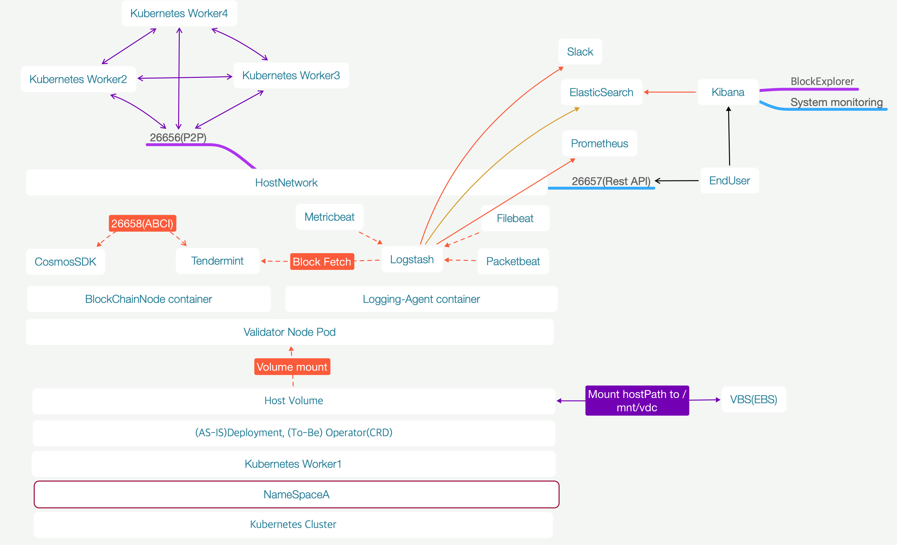
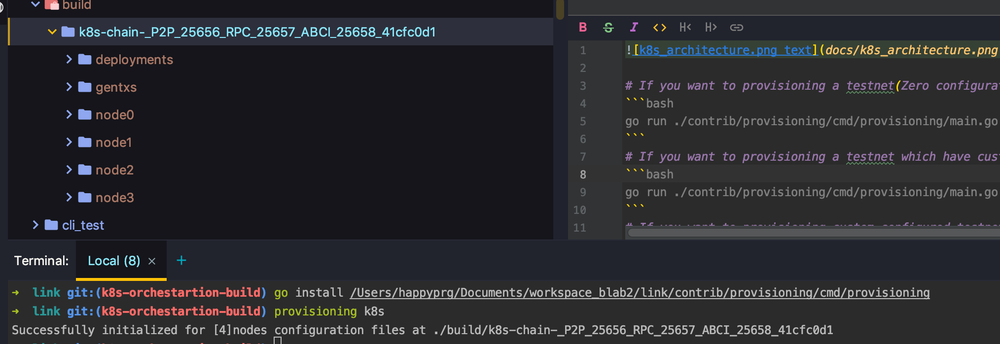

# If you want to provisioning a testnet(Zero configuration,Using Default ports)
```bash
go run ./contrib/provisioning/cmd/provisioning/main.go k8s
```
# If you want to provisioning a testnet which have custom ports
```bash
go run ./contrib/provisioning/cmd/provisioning/main.go k8s -n 24656 -e 24658 -r 24657
```
# If you want to provisioning custom configured testnet
```bash
go run ./contrib/provisioning/cmd/provisioning/main.go k8s -a build -c jeehong -m 0.000003stake -n 24656 -e 24658 -r 24657 -i 192.168.253.192,192.168.253.193,192.168.253.195,192.168.224.247
```
# Install provisioning tool
```bash
go install ./contrib/provisioning/cmd/provisioning
provisioning k8s  
```
# How to deploy, configure testnet
```
go run ./contrib/provisioning/cmd/provisioning/main.go k8s
//copy binary and deployments for k8s to already builded conf home, 
build/chain-id/binary/linkcli
                      linkd
build/chain-id/deployments/validator-0.yaml
                           validator-1.yaml
                           validator-2.yaml
                           validator-3.yaml
//make k8s copy CMD for rsyncing configuration files between local and pod from k8s select query
kubectl get po -l p2p-port=26656 -o custom-columns='NAME:metadata.name' --no-headers | xargs -I {} echo 'kubectl cp ./build/k8s-chain-p2p-21656-rpc-21657-abci-21658-4b227777d {}:/linkd/'
//scrap the stdout commands and run 
kubectl cp ./build/k8s-chain-P2P_26656_RPC_246570e17daca5f49  validator-p2p-26656-rpc-26657-0-5b749d7f5c-rbzt6:/linkd/
kubectl cp ./build/k8s-chain-P2P_26656_RPC_246570e17daca5f49  validator-p2p-26656-rpc-26657-1-54f648bf6f-w9mzz:/linkd/
kubectl cp ./build/k8s-chain-P2P_26656_RPC_246570e17daca5f49  validator-p2p-26656-rpc-26657-2-d744c9d6f-kq54c:/linkd/
kubectl cp ./build/k8s-chain-P2P_26656_RPC_246570e17daca5f49  validator-p2p-26656-rpc-26657-3-5498db47d9-rdsc2:/linkd/
//confirm rsync result
kubectl exec -ti validator-p2p-25656-rpc-25657-0-57c9497d7d-shbv9 -c linkd -- ls -al  k8s-chain-P2P_26656_RPC_246570e17daca5f49

//deploy k8s deployments
kubectl create -f build/chain-id/deployments
```
# Delete configuration files of pod
```bash
kubectl get po -l p2p-port=26656 -o custom-columns='NAME:metadata.name' --no-headers | xargs -I {} echo "kubectl exec -ti {} -- /bin/sh -c 'rm -rf /linkd/k8s-chain-P2P_26656_RPC_246570e17daca5f49'"
```
# Reference
https://medium.com/@dwdraju/copy-files-folders-to-and-from-kubernetes-pod-s-all-cases-d4a5749111b7
